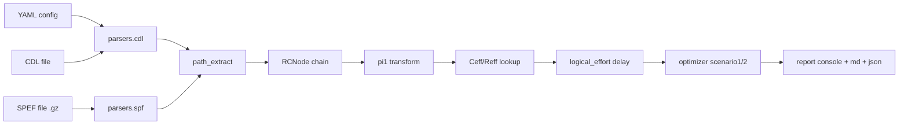

# ULE 路径寻优 Python 工具设计

> [!info] 关于本文档
> - **目标读者**：项目维护者、SRAM 时序优化工程师、代码评审者
> - **状态**：draft（待用户复审）
> - **来源**：本仓库 [reference/MinerU_markdown_202607290009769_d9be46e2.md](../../reference/MinerU_markdown_202607290009769_d9be46e2.md)（论文 [ULE] 解析稿，下称 [ULE]）
> - **关键校正**：题目中所谓 "ULE" 在论文里是 **Unified Logical Effort**（统一逻辑努力），**不是** Unified Layout Exploration。所有"路径寻优"指论文 Section IV 的固定段尺寸寻优，不含 Steiner/placement。

## 1. 背景与目标

### 1.1 业务场景

在 SRAM 关键路径（行驱动 / 位线 / 列选 / 时钟树 / 感放驱动等）的时序优化中，需要：

1. 解析网表（CDL / Spectre / HSPICE 子集）与寄生参数（完整 SPEF, IEEE 1481, 含 .gz）。
2. 抽取源点 A 到目标点 B 的关键路径，得到节点序列与每段 RC。
3. 应用 [ULE] 的 Unified Logical Effort 模型计算路径延时。
4. 实施两种寻优：
   - **场景 1**：固定边界 RC，对内部 RC 重新分配（总 R/C 守恒）使总延时最小。
   - **场景 2**：固定内部 RC，对边界 RC 在 {0.7, 0.85, 1.0, 1.15} 四档缩放，选最小延时档。
5. 输出控制台表格 + Markdown 报告 + JSON 结果。

### 1.2 论文公式映射（[ULE] L82–L216）

| 公式号 | 物理含义 | 工具实现位置 |
|---|---|---|
| (1) Elmore π 模型 | `core.pi1.transform()` | [ULE] L44–L46 |
| (3) LE 三参数 | `core.models` 中的 g/h/p | [ULE] L65–L79 |
| (4) ULE 单段延迟 | `core.logical_effort.delay_segment()` | [ULE] L82–L85 |
| (5) $h_w, p_w$ 定义 | `core.logical_effort.compute_hw_pw()` | [ULE] L90 |
| (7) N 段总延迟 | `core.logical_effort.delay_path()` | [ULE] L101–L105 |
| (13) 最优条件 | 验证用 | [ULE] L145–L147 |
| (16) 最优尺寸 | `core.optimizer.scenario1()` | [ULE] L168 |
| (19) $x_{opt}$ | 边界缩放初值 | [ULE] L210 |
| 松弛迭代 a/b/c | `core.logical_effort.relax()` | [ULE] L181–L189 |
| Table 1 收敛 | `verify/table1.py` | [ULE] L191 |

> [!note] 关于"PAI-1 模型"
> 用户提示中的 PAI-1 在工具实现里解释为 **π-1（单段 RC π 集总）**：将一段分布式 wire RC 折算为 (R_wire, 0.5·C_wire, 0.5·C_wire)。这是 [ULE] L42 论文模型所默认采用的等效形式。

## 2. 架构

### 2.1 模块划分

```
ule_opt/
├── __init__.py
├── cli.py                       # CLI 入口：run / verify / template
├── core/
│   ├── models.py                # Pydantic 数据模型
│   ├── pi1.py                   # π-1 模型转换
│   ├── logical_effort.py        # 公式 (1)–(20) + 松弛迭代
│   ├── effective_rc.py          # Ceff/Reff 查表
│   └── optimizer.py             # 场景 1 / 场景 2
├── parsers/
│   ├── cdl.py                   # CDL / Spectre / HSPICE 子集
│   ├── spf.py                   # 完整 SPEF + .gz
│   └── path_extract.py          # 调用图拓扑序 + 名字模式
├── io/
│   ├── yaml_config.py           # YAML 加载与 schema 校验
│   └── report.py                # 控制台表格 + Markdown + JSON
├── verify/
│   ├── table1.py                # 论文 Table 1 单元测试
│   ├── scenario1.py             # 场景 1 集成测试
│   └── scenario2.py             # 场景 2 集成测试
└── samples/
    ├── reference_sram_2_16_1_freepdk45.sp   # 来自 OpenRAM 仓库
    ├── synthesized_nand_chain.cdl           # 合成 8 段 NAND 链
    ├── synthesized_nand_chain.spef          # 合成 SPEF
    └── configs/nand_chain.yaml              # YAML 模板
```

### 2.2 数据流



## 3. 关键算法

### 3.1 π-1 模型

```python
def to_pi1(r_wire: float, c_wire: float) -> tuple[float, float, float]:
    """π-1 集总：(R, C/2, C/2)"""
    return r_wire, 0.5 * c_wire, 0.5 * c_wire
```

### 3.2 ULE 单段延迟

```python
def delay_segment(R_i, C_i, C_pi, R_wi, C_wi, C_next, g_i, p_i, tau):
    """论文式 (4) [ULE] L82–L85。

    入参：
        R_i   : 门 i 输出电阻 (Ω)
        C_i   : 门 i 输入电容 (F)    ← 用于 h_i = C_next / C_i
        C_pi  : 门 i 寄生输出电容 (F)
        R_wi  : 段 i 互连电阻 (Ω)
        C_wi  : 段 i 互连总电容 (F)  ← π-1 折算前
        C_next: 段 i+1 的 C_{i+1} (F)
        g_i, p_i : 该门逻辑功 / 寄生功
        tau   : R0 * C0 (s)
    """
    h_i = C_next / C_i
    h_wi = C_wi / C_i
    p_wi = R_wi * (0.5 * C_wi + C_next) / tau
    return g_i * (h_i + h_wi) + (p_i + p_wi)
```

### 3.3 最优尺寸 (式 16) + 松弛迭代

```python
def relax(C, Cw, g, Rw, tau, max_iter=5, tol=0.05):
    """论文式 (16) 松弛迭代 [ULE] L181–L189"""
    N = len(C) - 1  # C 含 C_1 ... C_{N+1}
    for it in range(max_iter):
        C_new = C.copy()
        for i in range(1, N):
            le = math.sqrt(C[i-1] * C[i+1])
            wc = math.sqrt(1 + Cw[i] / C[i+1])
            r_term = Rw[i-1] * C[i-1] / tau
            g_term = g[i] / (g[i-1] + r_term)
            C_new[i] = le * wc * math.sqrt(g_term)
        if max_rel_diff(C_new, C) < tol:
            break
        C = C_new
    return C
```

### 3.4 场景 1：内部 RC 守恒重分配

1. 输入：$C_1, R_1, C_{N+1}, R_{N+1}$ 固定；$\{C_i\}, \{R_i\}$ 初值。
2. 调用 `relax()` 得到 $C_i^*$。
3. 守恒归一化：$\alpha = \sum_{i=2}^{N} C_{\text{orig},i} / \sum_{i=2}^{N} C_i^*$；$C_i \leftarrow C_i \cdot \alpha$。R 类同。
4. 重算总延时 $d$。
5. 器件映射：`nfin_i = round((C_i / C0_min_inv - 1) / C_finger_unit)`，其中 `C0_min_inv` 是 `PathModel.C0`（最小反相器输入电容，见 §4）；当 $|C_i - C_{\text{orig},i}|/C_{\text{orig},i} > 20\%$ 输出 VT 调整提示（高 $\to$ LVT，低 $\to$ HVT）。

### 3.5 场景 2：边界缩放扫描

```python
SCALE_LADDER = [0.7, 0.85, 1.0, 1.15]
def scenario2(path_model):
    """复用内部 R/C，扫描 4×4 = 16 档边界组合"""
    results = []
    for s_in in SCALE_LADDER:
        for s_out in SCALE_LADDER:
            C1 = path_model.C1_orig * s_in
            C_N1 = path_model.Cout_orig * s_out
            d = delay_path_with_boundary(path_model, C1, C_N1)
            results.append((s_in, s_out, d))
    return min(results, key=lambda r: r[2])
```

## 4. 数据模型（节选）

```python
class RCValue(BaseModel):
    r: float = Field(ge=0)
    c: float = Field(ge=0)

class RCNode(BaseModel):
    name: str
    r: float = Field(ge=0)
    c: float = Field(ge=0)
    gate_type: Literal["INV", "NAND2", "NAND3", "NOR2", "NOR3", "BUF", "CUSTOM"] = "INV"
    ceff_override: float | None = None
    reff_override: float | None = None

class PathModel(BaseModel):
    nodes: list[RCNode]            # 含首末共 N+1 个
    tau: float                      # R0*C0
    R0: float
    C0: float
    source: Literal["CDL", "SPF"]
```

## 5. 错误处理

| 场景 | 行为 | 退出码 |
|---|---|---|
| YAML schema 校验失败 | 抛 Pydantic ValidationError + 字段路径 | 2 |
| CDL 未闭合 SUBCKT | 列出未闭合行号 | 3 |
| A→B 路径不可达 | 输出 BFS 候选 | 4 |
| π-1 输入负数 | ValueError | 5 |
| 边界缩放越下界 | 自动夹紧到 0.7 + WARN | 0 |

## 6. 验证模式

```
ule_opt verify --case table1     # 8 段 NAND + 0.1mm 线 → 论文 Table 1 iter 5
ule_opt verify --case scenario1  # 内部 R/C 守恒重分配
ule_opt verify --case scenario2  # 边界 4 档缩放
```

每条 verify 用例返回 `PASS`（退出码 0）或 `FAIL`（退出码 1），并打印与基准解的相对偏差 %；table1 容差 ±5%，scenario1 总 R/C 守恒容差 ±1%。

## 7. 交付清单

- 完整 Python 源码（含模块注释与 docstring）
- `requirements.txt`（pydantic>=2, PyYAML, click）
- YAML 配置模板：`samples/configs/nand_chain.yaml`
- 样例 CDL + SPEF：`samples/synthesized_nand_chain.{cdl,spef}`
- 真实参考：`samples/reference_sram_2_16_1_freepdk45.sp`（来自 OpenRAM 仓库）
- Obsidian 风格 `README.md` + `ALGORITHM.md`
- `tests/`：py 单元测试 4 个

## 8. 范围之外（明确不做）

1. Steiner / placement / 拓扑搜索。
2. 6T bitcell 稳定性、SA latch 再生时间、时钟偏斜。
3. SPICE 仿真执行——本工具仅做模型层寻优，仿真需用户用 EDA 工具自验。
4. 分布式 PEX（寄生抽取）调用——输入已假定为解析好的 SPEF/CDL。
5. 多线程 / GPU 加速——所有算法 N 段 ≤ 100 时 Python 单线程足够。

## 9. 风险与缓解

| 风险 | 缓解 |
|---|---|
| SPEF 大文件解析慢 | 增量解析 + 缓存 |
| 路径提取可能漏级 | 用拓扑序 + 名字模式两级兜底 |
| 场景 1 守恒归一化破坏等努力 | 在归一化后跑一次额外松弛迭代 |
| 缩放档 0.7 物理不成立 | 触发 WARN 但不阻断，由用户决定 |

## 10. 验收口径

完成 = 下列全部通过：
- `python -m ule_opt.cli verify --case table1` 输出与论文 [ULE] L191 Table 1 iter 5 偏差 ≤ 5%。
- `verify --case scenario1` 总 R/C 守恒偏差 ≤ 1%。
- `verify --case scenario2` 输出 16 档并选中最小延时档。
- `python -m pytest tests/` 全绿。
- `python -m ule_opt.cli run --config samples/configs/nand_chain.yaml` 输出一份 `reports/<ts>/` 目录含 `.md` 与 `.json`。

---

> [!tip] 后续步骤
> 1. 用户复审本 spec
> 2. 通过后调用 `writing-plans` skill 进入实现规划阶段
> 3. 实现按 plan 逐模块落盘并跑通验证
